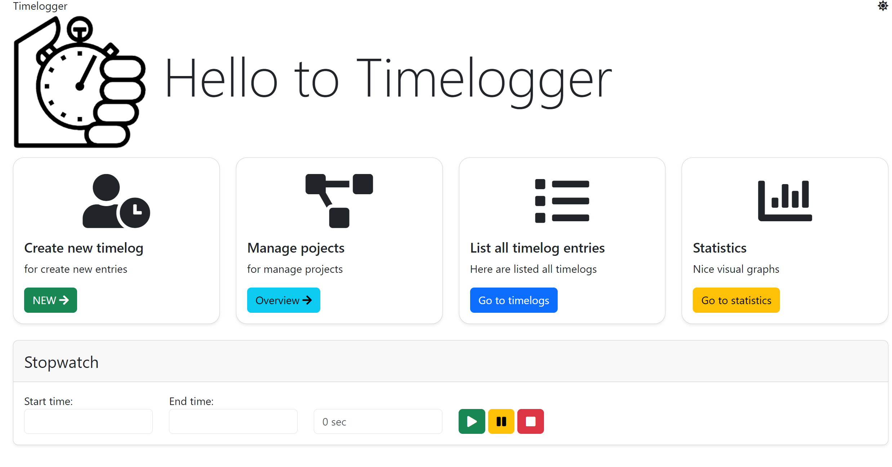
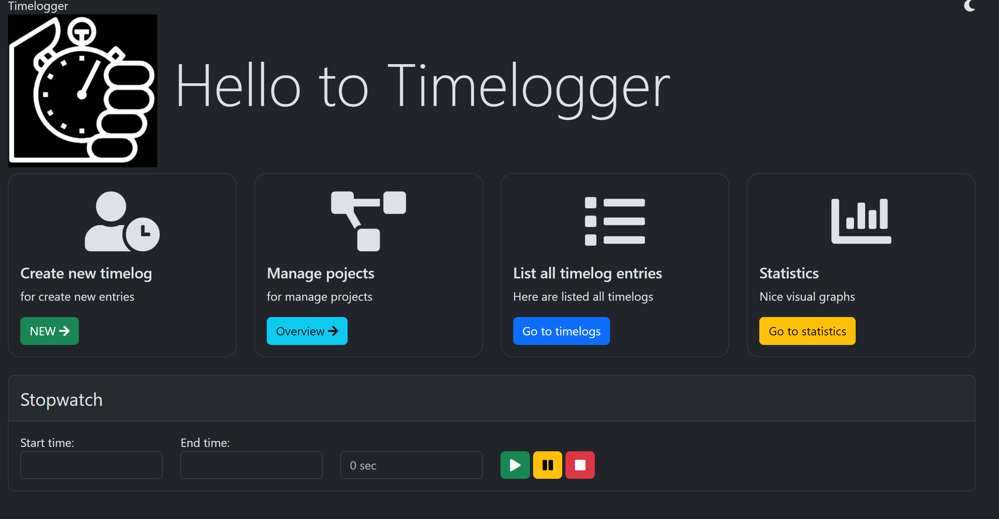

# zeiterfassung
Small nice tool for editing work times.
It's a demo project which isn't ready to run on production.


## License
[MIT](https://choosealicense.com/licenses/mit/)


## Installation
As usual for a PHP project run
```
$ composer install
```

Next step, edit file `.env` or `.env.local`
Example for MariaDB:
```
DATABASE_URL="mysql://<USER>:<PASSWORD>@<HOST>:<PORT>/<DB_NAME>?serverVersion=10.11.8&charset=utf8mb4"
```

When the connection is established, run command to update tables
```
$ bin/console doctrine:migrations:migrate
```

Run fixtures is optional

If all migrations are done, you are ready to start application

if Symfony CLI is installed you can try:
```
$ symfony serve
```

## Usage
When the server is started you'll see following homepage:



Left to right:
* **NEW** Create a manual timelog
* **Ovewrview** You can manage projects, see details
* **Go to timelogs** a table of all timelogs with availability to search and filter logs
* **Go to statistics** A visual interface to see logs in graphical way

At the bottom is the automatic stopwatch which tracks work times. If work is paused you can also click
on the pause button to stop tracking. And afterwards resuming is also available, like a usual stopwatch 

With darmode enabled, it looks like this:
